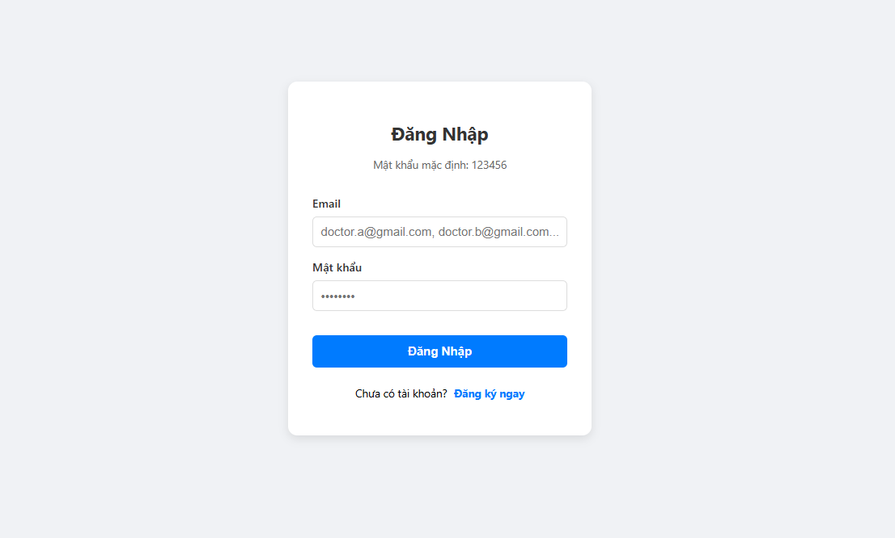
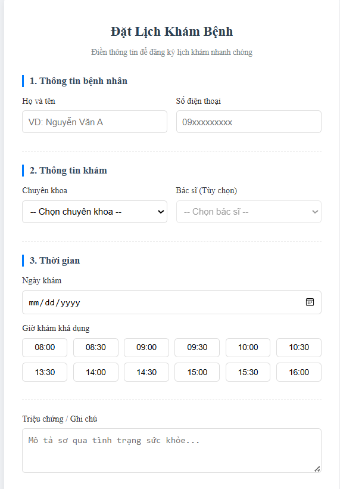
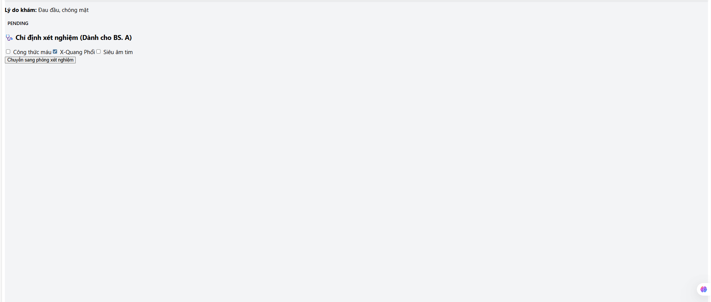
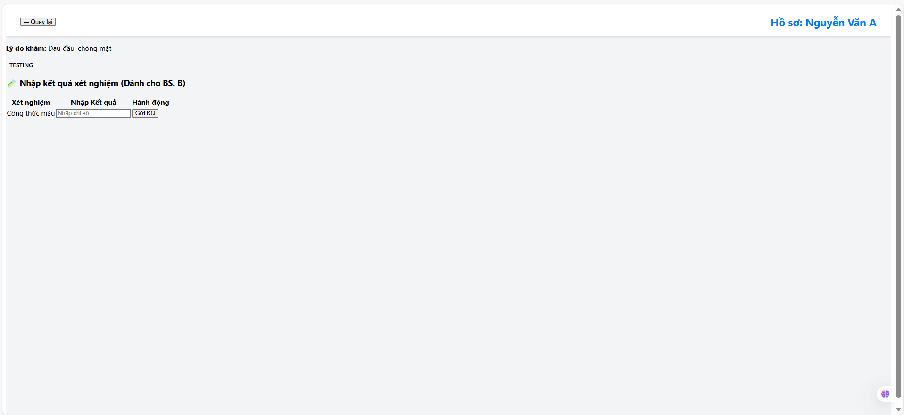
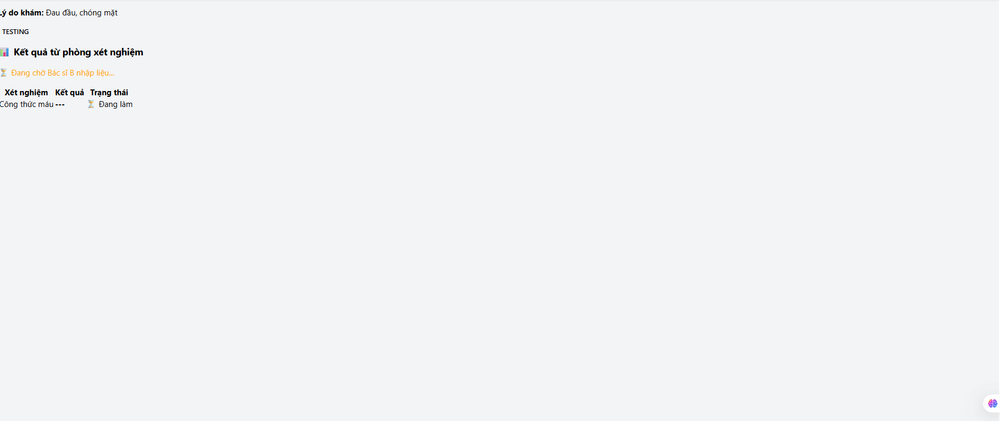

# 🏥 CliBo - Clinic Booking System

**CliBo** là hệ thống quản lý phòng khám toàn diện, được thiết kế để số hóa quy trình khám chữa bệnh, kết nối liền mạch giữa Bệnh nhân, Bác sĩ và Nhân viên phòng khám. Dự án được xây dựng dựa trên tài liệu "From Design to Implement" của nhóm OOAD.

---

## 🌟 Tính năng & Hình ảnh Demo

Dưới đây là các chức năng chính của hệ thống cùng hình ảnh minh họa thực tế.

### 1. Quản lý Tài khoản (Account Management)
Hệ thống hỗ trợ phân quyền người dùng và bảo mật thông tin.

#### Đăng nhập (Login)
Giao diện đăng nhập tập trung, tự động điều hướng dựa trên vai trò người dùng (Bác sĩ/Bệnh nhân/Nhân viên).


#### Đăng ký (Register)
Cho phép bệnh nhân mới tạo tài khoản nhanh chóng để sử dụng dịch vụ.


### 2. Dành cho Bệnh nhân (Patient)

#### Đặt lịch khám (Booking Appointment)
Bệnh nhân tìm kiếm bác sĩ, chọn chuyên khoa và khung giờ trống để đặt lịch hẹn.


### 3. Dành cho Bác sĩ (Doctor Workflow)

#### Chỉ định xét nghiệm (Test Requests)
Bác sĩ xem hồ sơ bệnh án và đưa ra danh sách các xét nghiệm cần thiết từ danh mục có sẵn.


#### Nhập kết quả xét nghiệm (Test Results Input)
Giao diện cập nhật chi tiết các chỉ số kết quả sau khi thực hiện xét nghiệm.


#### Chẩn đoán & Kết luận (Diagnosis)
Bác sĩ tổng hợp thông tin lâm sàng và cận lâm sàng để đưa ra chẩn đoán cuối cùng và hướng điều trị.


---

## 🛠 Công nghệ sử dụng (Tech Stack)

* **Frontend:** ReactJS
* **Backend:** Java / Spring Boot
* **Database:** PostgreSQL
* **Tools:** Docker, Maven, Git

## ⚙️ Cài đặt và Chạy dự án

### Yêu cầu hệ thống
* Java JDK 17 trở lên
* Node.js & npm
* PostgreSQL

### Hướng dẫn chạy

**1. Backend (Spring Boot)**
```bash
cd backend
./mvnw clean install
./mvnw spring-boot:run

👥 Nhóm phát triển (Development Team)
Project: Object-Oriented Analysis and Design (OOAD) - Group 8

Nguyen Viet

Ho Hang

Le Viet

Phan Viet

Nguyen Linh
